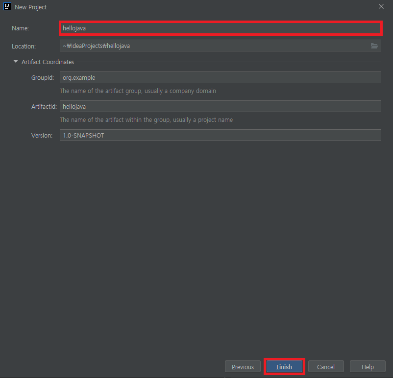
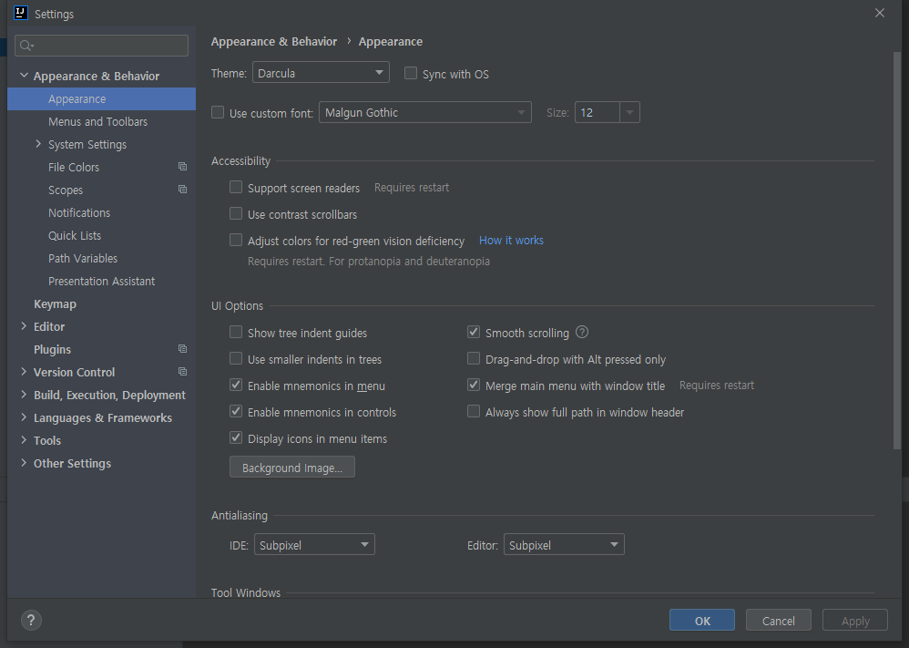

# 목차

- [목차](#목차)
- [1. Intellij Community 버전 설치](#1-intellij-community-버전-설치)
  - [1.1. [필수] 인코딩 설정을 utf-8로 변경](#11-필수-인코딩-설정을-utf-8로-변경)
  - [1.2. [선택] 폰트 사이즈를 변경](#12-선택-폰트-사이즈를-변경)
  - [1.3. [선택] 코드 테마를 변경](#13-선택-코드-테마를-변경)

# 1. Intellij Community 버전 설치

인텔리제이 커뮤니티 버전은 무료 IDE이다. 다음 사이트에서 툴박스를 받아보자.  

[https://www.jetbrains.com/ko-kr/toolbox-app/](https://www.jetbrains.com/ko-kr/toolbox-app/)

설치하는 방법을 모르겠다면 이 강의보다는 윈도우즈 사용법 기초를 보는 것을 추천한다.  


여기서 `Intellij IDEA Community Edition`을 다운로드 받으면 된다.  

설치를 하고 실행을 하고 다음 절차를 따라하자.  

프로젝트 생성을 위해 New Project를 눌러보자.  


좌측 메뉴에서 Gradle을 선택하고 Additional Libraries and Frameworks에서 Java를 선택한다.  


Name에 `hellojava`를 입력하고 finish를 누른다.  



그리고 다음과 같은 화면이 등장하면 일단 프로젝트 생성은 성공한 것이다.  


이것이 전부는 아니다. 정신 건강을 위해 필요한 세팅 몇 가지를 추천하겠다.  

상단의 메뉴에서 `File > Settings...`를 선택한다. 단축키는 친절하게 표시되어 있는 것과 같이 `Ctrl + Alt + S`이다. 물론 `+`키 까지 누르면 안되며, 이를 누른 사람들은 윈도우즈 10 사용법 책부터 읽자. 애초에 누를 수도 없다...  


이와 같은 화면이 등장하면 성공!  



여기서 해야 할 설정은 다음과 같다.  

- [필수] 인코딩 설정을 utf-8로 변경  
- [선택] 폰트 사이즈를 변경
- [선택] 코드 테마를 변경

시작해보자.  

## 1.1. [필수] 인코딩 설정을 utf-8로 변경

위의 Settings 창을 띄우자. 꺼둔 경우라면 위에서 소개한 것처럼 켜두자.  

검색 창에 `encoding`을 검색하자. `ctrl + f`로 바로 검색창으로 이동 가능하다.  


먼저 수정할 메뉴는 `Editor > File Encodings`이다.  


apply를 눌러서 적용하자. 창을 닫지는 마세요. 참고로 여러분 각자 선택하는 부분이 다를 수도 있지만 무조건 utf-8을 고르시면 됩니다.  


적용완료!  
이번에는 콘솔의 인코딩을 변경할 것인데 좌측의 메뉴에 보면 `Console`이 바로 보일 것이다. `Editor > General > Console`의 인코딩도 수정해보자.  


이 역시 apply를 누르자. 이번에는 OK를 눌러 닫자.  

이제 다시 앞서 본 화면으로 돌아왔을텐데 이번에는 최초로 코드를 작성해볼 것이다. 실행이 제대로 되는지 테스트하려는 의도이다.   

아! 그리고 앞서 인코딩 설정을 한 이유는 외계문자처럼 출력되는 것을 고치기 위함이다. 영어는 상관 없겠지만 한글이 깨질 수가 있다.  

다음과 같이 `클래스(Class)`를 만들어보자. 참고로 아주 지겹게 볼 단어이다.  


좌측의 메뉴에서 src 폴더 아래의 main 폴더 아래에 있는 java 폴더를 선택하고 오른쪽 마우스를 클릭하자. 참고로 `alt + insert`를 클릭해도 동일하다.  


위와 같은 창이 등장하면 성공. `패키지`와 `클래스`를 함께 만들 것인데 다음과 같이 입력하면 된다. 혹시나 영타에 자신이 없다면 복사 붙여넣기를 하자.  

`com.example.hellojava.MyFirstApplication`

여기서 패키지는 `com.example.hellojava`이다.  
여기서 클래스는 `MyFirstApplication`이다.  


위와 같이 잘 입력하거나 복붙을 했다면 엔터를 입력하자. OK를 입력해도 좋다.  


이렇게 코드를 입력할 수 있는 창이 등장하였다. 본인처럼 폰트가 작아서 불편한 사람이 있을텐데, 불편함은 잠시 참고 코드를 입력해보자.  


위 화면과 같이 커서를 위치시키자. 엔터를 처서 공간을 만들면 된다. 이게 어렵다면 윈도우즈 10 사용 설명을 하는 책을 읽자.  

커서를 위치시켰으면 psvm을 입력하자. 너무 빨리 입력하면 이 프로그램이 여러분을 도와주지 못할 수도 있다.  


엔터를 입력하면 다음과 같은 화면이 나온다.  


이제 여기서 화면에 출력하기 위한 코드를 작성해볼 것이다.  
psvm과 마찬가지로 sout을 천천히 입력하고, `Hello, Java!`라는 메세지를 입력해보자.  


단축키와 스니펫(psvm, sout과 같은)을 익혀두면 영어 타자가 느려도 걱정 없이 코딩할 수 있다.  

코드 입력창 옆에 초록색 재생버튼(▶)이 보일텐데, 이를 눌러보자.  


위와 같은 화면이 등장할 것이다. `Run 'MyFirstApplica....main()`을 클릭하거나 `ctrl + shiflt + f10`을 누르자.  

그럼 아래에 검은색 화면이 보일 것이다.  


우리가 입력한 메세지를 `문자열`이라고 부르며 내용은 `Hello, Java!`였다. 
문자열은 큰 따옴표(`"`)를 감싼 글을 의미한다.  

한국어도 잘 출력되는지 보기 위해 문자열을 `안녕, 자바!`로 변경해보자. 다음 화면을 보기 전에 각자 해보면 더 좋다.  


위에서 소개한 방법대로 실행해보자.  


위 화면과 같이 잘 출력되면 정말 좋은 일이다. 하지만 빨간 글씨로 다음과 같은 메세지가 출력되면 추가적인 절차가 필요하다.  

```text
unmappable character (0xec) for encoding x-windows-949
```

메뉴바의 Help에 `Edit Custom VM Options...`를 클릭해보자.  


클릭하면 다음과 같은 화면이 등장한다.  


드래그 한 부분이 여러분한테 없는 부분일 것이다. 이 부분을 반드시 아래에 제공하는 텍스트를 `복사`해서 붙여넣자. 괜히 직접 입력하다가 IDE 고치다가 개발의 흥미를 잃을 수도 있다.  

```text
-Dfile.encoding=UTF-8
-Dconsole.encoding=UTF-8
```

다른 부분들은 삭제하면 안되고 위 내용만 추가로 붙여 넣자.  
잘 붙여넣었다면 `ctrl + s`를 눌러 저장하자.  

그리고 다음과 같이 창을 닫자.  


닫는 방법은 아주 다양하다.  

- 해당 탭 끝의 x 버튼 클릭
- 해당 탭에서 ctrl + f4
- 해당 탭에 휠 클릭

무서운 창은 닫고 다시 위 코드를 실행해보면 정상적으로 동작한다.  

## 1.2. [선택] 폰트 사이즈를 변경

눈이 좋은 분들은 관계 없는 내용이지만 본인은 폰트 크기를 22 ~ 24 사이로 설정하고 쓰기 때문에 소개한다.  

`ctrl + alt + s`를 눌러 설정 창을 열고,  `ctrl + f`를 눌러 검색하자.  


`Editor > Font`를 수정할 것이다.  


apply, ok를 각각 눌러 수정을 완료하자.  


이제 옆 자리 사람도 내 코드를 보며 훈수를 둘 수 있을만큼 폰트 사이즈가 커졌다.  

## 1.3. [선택] 코드 테마를 변경

자신만의 컬러로 코드를 꾸밀 수 있다. 본인은 개인적으로 `RainbowDrops`라는 컬러 테마를 좋아한다.  

[http://www.eclipsecolorthemes.org/?view=theme&id=24587](http://www.eclipsecolorthemes.org/?view=theme&id=24587)

위 사이트에 있으며, 마음에 안들면 다른 것을 찾아서 고르자.  


이 친구를 다운받아두자.  

그리고 다시 설정 창을 열자. `ctrl + alt + s`를 누른고 `scheme`을 검색하자.  


경로를 찾아서 파일을 선택해준다.  


그리고 OK OK OK를 눌러 빠져나오면 다음과 같이 코드 창이 변경되어 있을 것이다.  


나는 태어날 때부터 이 테마를 사용하였기 때문에 이게 편하다.  
앞으로 강의도 이 테마로 렌더링 된 코드가 보일 것이다.  

