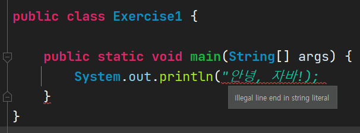
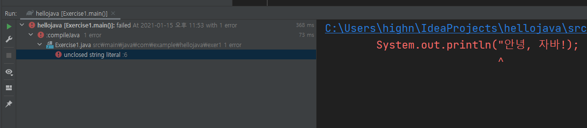
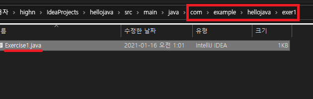

# 목차

- [목차](#목차)
- [연습1 - 화면에 출력해보기](#연습1---화면에-출력해보기)
- [1. 해보자](#1-해보자)
- [2. 더 해보자](#2-더-해보자)
- [3. 생각 해보기](#3-생각-해보기)

# 연습1 - 화면에 출력해보기

지난 시간에 만든 프로젝트를 그대로 사용할 것이다. 여기서 패키지를 추가해 나가면서 실습을 진행할 것이다.  

이번에는 패키지를 만들어보자. 공식적인 첫 연습이므로 `exer1`이라는 이름의 패키지를 만들 것이다.  


새 패키지가 만들어졌다. 패키지는 공간을 구분하는 일종의 폴더라고 보면 된다.  
폴더라는 단어를 모른다면 윈도우즈 10을 설명하는 책을 읽고 오자.  


여기에 지난 시간에 배운 것처럼 클래스를 만들 것이다. exer1을 선택한 상태에서 `alt + insert`를 눌러도 좋다.  


엔터를 누르면 `Exercise1`라는 클래스가 생성된다. 지난 시간에 배운 것처럼 psvm으로 무언가 심각한 코드를 자동완성 시켜보자.  


지금부터 앞으로 등장할 강의에서 특별한 경우를 제외하고는 다음 내용들은 생략된다.  

- 패키지 생성
- 클래스 생성

다만 여러분에게 패키지와 클래스 생성을 부탁할 것이다. 패키지와 클래스의 생성은 여러분이 담당하자.  

연습2를 하는 날에는 `exer2` 패키지와 `Exercise2` 클래스를 생성하면 된다. 이제 정말 본격적으로 시작해보자.  

# 1. 해보자

지난 시간에 환경 구축을 위해 알 수 없는 코드를 마구 입력하였다. 그 중에 이런 코드가 있었다.  

```java
System.out.println("안녕, 자바!");
```

여기서 여러분이 눈 여겨 볼 부분은 `"안녕, 자바!"`이다.  
이 메세지처럼 글을 큰 따옴표(`"`)로 둘러싼 것을 `문자열`이라고 부른다.  
더 정확한 표현은 `문자열 리터럴(String Literal)`이라고 부르지만 지금 당장은, 아니 앞으로도 `문자열`이라고 해도 무방하다.  

그 다음 눈 여겨볼 부분은 `println`이다. 이 친구는 함수(메서드)라고 부른다.  
여러분이 알던 그 함수가 맞다. 함수 f(x)에 숫자를 넣으면 함수식에 따라 값이 나오는 것 처럼, `println`라는 함수에 문자열(f(x)의 x에 해당)을 넣으면 함수값이 아닌 화면에 출력하는 것이 다를 뿐이다.  
`print`는 여러분이 알고 있는 `출력`이 맞다. `ln`은 `line`의 줄임말이다. 즉, 한 줄을 출력하겠다는 의미이다.  
지금은 함수에 대해 이해하지 않아도 좋다. 컴퓨터에게 무언가 부탁을하려는구나 정도로 이해해도 충분하다.  

마지막으로 `System.out`은 지금 당장 중요하지는 않다. out은 `출력`을 의미한다. 모니터로 여러분이 입력한 메세지가 보였으므로 이는 `출력`이라고 부른다. 따라서 이 부분은 무언가 출력하겠구나 생각하자.  

아! 참고로 세미콜론(`;`)은 문장의 끝을 나타내며 필수이다. 물론 붙일 필요가 없는 경우도 있는데 이는 진행하면서 설명할 것이다.  

다음과 같은 코드를 입력해보자. 앞서 준비한 `Exercise1` 클래스에 코드를 적으면 된다.  

```java
package com.example.hellojava.exer1;

public class Exercise1 {

    public static void main(String[] args) {
        System.out.println("안녕, 자바!");
        System.out.println("여기는 아무 말이나 적어보자.");
    }
}
```

그리고 실행해보자.  

```bash
안녕, 자바!
여기는 아무 말이나 적어보자.
```

`println`은 `print line`을 의미한다고 하였다. 즉 한 줄을 출력하도록 부탁하는 함수(메서드)이다. 함수를 사용하는 것을 `호출`이라고 부른다.  

위의 코드를 보면 println이 두 번 호출되었기 때문에 두 줄에 걸쳐서 출력이 된 것이다!!

궁금하면 여러분이 그 아래 줄에 출력을 위한 코드를 적고 실행해봐도 좋다.  

# 2. 더 해보자

이번에는 코드를 고의적으로 망가뜨려보고 어떤 일이 발생하는지 살펴볼 것이다.  

첫 번째로 해볼 것은 문자열을 망가뜨리기이다. 문자열은 큰 따옴표 한 쌍으로 감싸진 글자들이라고 하였다. 하지만 큰 따옴표 하나를 지우면 어떻게 될까?  

```java
package com.example.hellojava.exer1;

public class Exercise1 {

    public static void main(String[] args) {
        System.out.println("안녕, 자바!);
    }
}
```



문자열 리터럴에서 줄 끝이 잘못되었다는 메세지를 출력해준다. 이와 같이 똑똑하게 여러분을 도와주기 때문에 코드를 잘못 입력하더라도 알려준다. 영어가 부족하면 구글 번역기를 써도 뭐라고 하는 사람 아무도 없으므로 당당하게 구글 번역기를 사용하자!  

이 코드를 굳이 실행시켜보면 다음과 같은 에러가 출력된다.  



과하다 싶을 정도로 친절하게 어디가 잘못됐는지 지적해준다. 심지어 메세지로 문자열 리터럴이 닫히지 않은 것이라고 해준다.  
침착하게 가이드에 따라 코드를 수정하면 된다.  

각자 세미콜론을 제거하고 어떤 일들이 발생

# 3. 생각 해보기

출력하는 코드를 제외하고는 분석을 하지 않았다. 앞으로 소개할 친구들이기 때문이다.  

그러나 톳씨하나 모두 궁금하고 해결되지 않으면 힘든 사람들을 위해 가볍게 line by line으로 읽어주고 넘어가도록 하겠다.  

우선 다음 코드를 기준으로 설명한다.  

```java
package com.example.hellojava.exer1;

public class Exercise1 {
    public static void main(String[] args) {
        System.out.println("안녕, 자바!");
    }
}
```

line1: `package`는 `키워드`이다. `키워드`는 문법을 구성하는 단어이다. `package`라는 키워드는 현재 자바 파일이 위치할 폴더를 의미한다. 패키지는 코드들을 저장해둔 폴더라고 생각하면 쉽다. 디렉토리의 포함관계는 점(`.`)으로 구분된다. 따라서 Exercise1.java라는 파일은 com 폴더 아래의 example 폴더 아래의 hellojava 폴더 아래의 exer1 폴더 아래에 위치한다.  



여러분의 바탕화면처럼 복잡하게 만든다면 원하는 파일을 찾기 힘들 것이다. 용도 별로 폴더를 만들면 파일을 찾기가 훨씬 수월할 것이다.  

이와 마찬가지로 자바 소스 코드(파일)도 용도별로 패키지(폴더)를 만들어 구분해둔다면 코드를 관리하기가 더 쉬워지기 때문에 필요하다.  

line2: 공백이다.  

line3: 여기서 키워드는 `public`, `class`이다. 처음에 `public`은  나중에 공부할 `접근 지정자`로 공개 범위를 지정하는 문법이라고 생각하면 편하다. `class`는 클래스를 선언하는 문법으로 class 키워드 뒤에 오는 이름의 공간을 만든다고 생각하면 쉽다. 여기서는 `Exercise1`이라는 공간을 만든 것이다. 정리하자면 전체 공개 되어 있는 `Exercise1`이라는 공간(클래스)을 하나 만들어달라고 컴퓨터에게 부탁하는 것이다.  

끝에 중괄호(`{`)가 있는데 맨 끝 줄의 중괄호(`}`)와 한 쌍이다. 이 블록 사이에 `Exercise1`이라는 공간에 무엇을 정의할 지 적는다. 여기서는 main 함수(메소드)만 적혀 있다.  

line4: 이는 복잡하니 간단히만 설명하겠다. 키워드 `static`은 클래스에 소속시키는 문법이다. main이라는 함수(메소드)를 `Exercise1` 클래스에 소속시키겠다는 의미이다. 또, 마찬가지로 끝에 중괄호(`{`)가 보이는데 이는 line6의 중괄호(`}`)와 한 쌍이다. 이 사이에 `실행할 코드`를 넣는다.  

이 경우에는 실행할 코드가 다음과 같다.  

```java
System.out.println("안녕, 자바!");
```

사실 main 함수(메소드)는 이 프로그램의 시작점이다. 즉 line5부터 프로그램이 시작된다고 보면 된다. line5에는 위의 코드가 있었으므로 `안녕, 자바!`라는 메시지가 화면에 출력이 되는 것이다. 물론 더 이상 실행할 코드가 없었으므로 프로그램은 바로 종료가 된 것이다.  

위의 내용은 앞으로도 등장하므로 `아. 이런게 있네?` 정도의 자세만 취하고 넘어가자.  

고민해볼 주제

1. 자바의 함수(메소드)와 수학의 함수의 차이점
2. 수학의 함수에서는 값을 넘겼는데 println에도 값을 넘겼었나?!