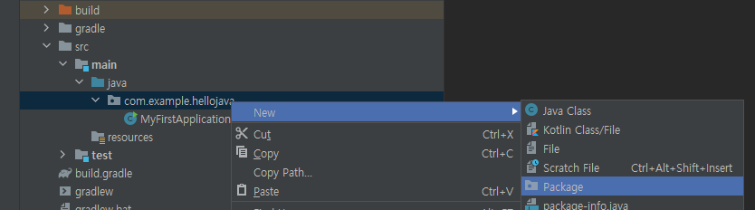
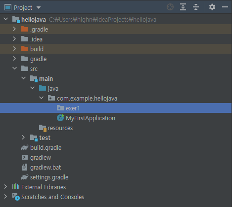
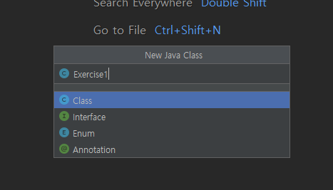
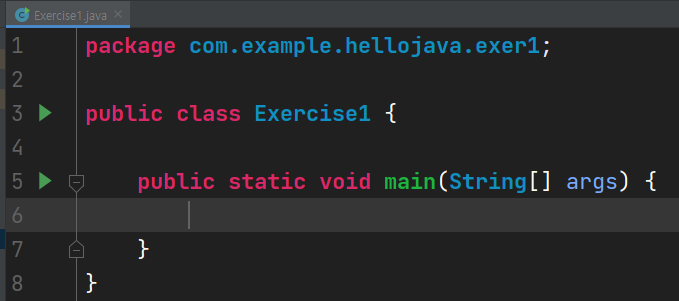

# 목차

- [목차](#목차)
- [연습1 - 화면에 출력해보기](#연습1---화면에-출력해보기)
- [1. 해보자](#1-해보자)

# 연습1 - 화면에 출력해보기

지난 시간에 만든 프로젝트를 그대로 사용할 것이다. 여기서 패키지를 추가해 나가면서 실습을 진행할 것이다.  

이번에는 패키지를 만들어보자. 공식적인 첫 연습이므로 `exer1`이라는 이름의 패키지를 만들 것이다.  



새 패키지가 만들어졌다. 패키지는 공간을 구분하는 일종의 폴더라고 보면 된다.  
폴더라는 단어를 모른다면 윈도우즈 10을 설명하는 책을 읽고 오자.  



여기에 지난 시간에 배운 것처럼 클래스를 만들 것이다. exer1을 선택한 상태에서 `alt + insert`를 눌러도 좋다.  



엔터를 누르면 `Exercise1`라는 클래스가 생성된다. 지난 시간에 배운 것처럼 psvm으로 무언가 심각한 코드를 자동완성 시켜보자.  



지금부터 앞으로 등장할 강의에서 특별한 경우를 제외하고는 다음 내용들은 생략된다.  

- 패키지 생성
- 클래스 생성

다만 여러분에게 패키지와 클래스 생성을 부탁할 것이다. 패키지와 클래스의 생성은 여러분이 담당하자.  

연습2를 하는 날에는 `exer2` 패키지와 `Exercise2` 클래스를 생성하면 된다. 이제 정말 본격적으로 시작해보자.  

# 1. 해보자

지난 시간에 환경 구축을 위해 알 수 없는 코드를 마구 입력하였다. 그 중에 이런 코드가 있었다.  

```java
System.out.println("안녕, 자바!");
```

여기서 여러분이 눈 여겨 볼 부분은 `"안녕, 자바!"`이다.  
이 메세지처럼 글을 큰 따옴표(`"`)로 둘러싼 것을 `문자열`이라고 부른다.  
더 정확한 표현은 `문자열 리터럴(String Literal)`이라고 부르지만 지금 당장은, 아니 앞으로도 `문자열`이라고 해도 무방하다.  

그 다음 눈 여겨볼 부분은 `println`이다. 이 친구는 함수(메서드)라고 부른다.  
여러분이 알던 그 함수가 맞다. 함수 f(x)에 숫자를 넣으면 함수식에 따라 값이 나오는 것 처럼, `println`라는 함수에 문자열(f(x)의 x에 해당)을 넣으면 값이 아닌 화면에 출력하는 것이 다를 뿐이다.  
`print`는 여러분이 알고 있는 `출력`이 맞다. `ln`은 `line`의 줄임말이다. 즉, 한 줄을 출력하겠다는 의미이다.  
지금은 함수에 대해 이해하지 않아도 좋다. 컴퓨터에게 무언가 부탁을하려는구나 정도로 이해해도 충분하다.  

마지막으로 `System.out`은 지금 당장 중요하지는 않다. out은 `출력`을 의미한다. 모니터로 여러분이 입력한 메세지가 보였으므로 이는 `출력`이라고 부른다. 따라서 이 부분은 무언가 출력하겠구나 생각하자.  

다음과 같은 코드를 입력해보자. 앞서 준비한 `Exercise1` 클래스에 코드를 적으면 된다.  

```java
package com.example.hellojava.exer1;

public class Exercise1 {

    public static void main(String[] args) {
        System.out.println("안녕, 자바!");
        System.out.println("여기는 아무 말이나 적어보자.");
    }
}
```

그리고 실행해보자.  

```bash
안녕, 자바!
여기는 아무 말이나 적어보자.
```

`println`은 `print line`을 의미한다고 하였다. 즉 한 줄을 출력하도록 부탁하는 함수(메서드)이다. 함수를 사용하는 것을 `호출`이라고 부른다.  

위의 코드를 보면 println이 두 번 호출되었기 때문에 두 줄에 걸쳐서 출력이 된 것이다!!

