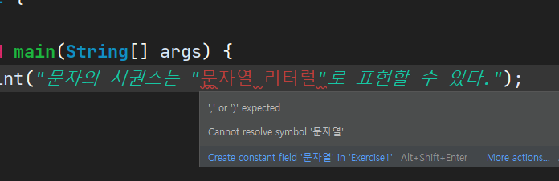
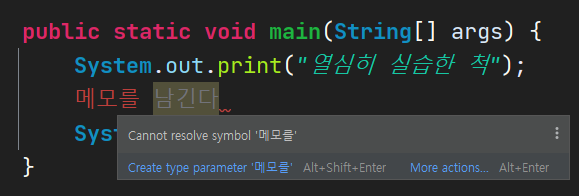
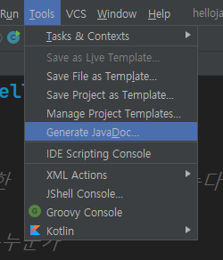
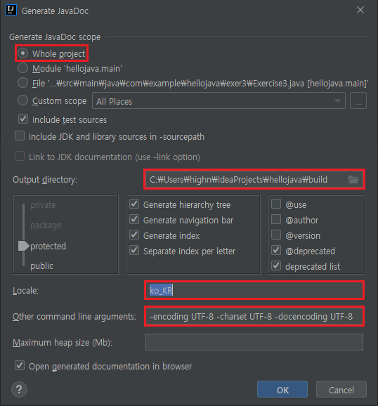
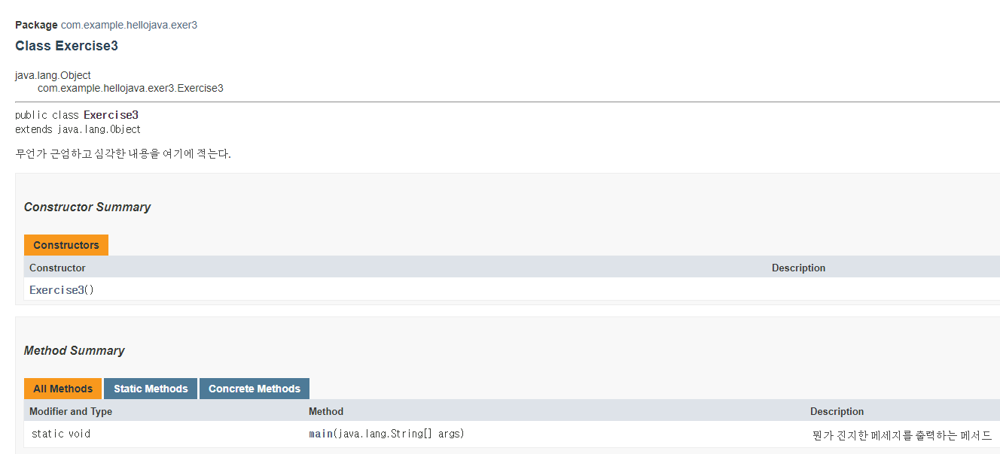

# 목차

- [목차](#목차)
- [연습3 - 이스케이프 문자와 주석](#연습3---이스케이프-문자와-주석)
- [1. 해보자](#1-해보자)
- [2. 더 해보자](#2-더-해보자)
  - [2.1. 한 줄 주석](#21-한-줄-주석)
  - [2.2. 여러 행 주석](#22-여러-행-주석)
  - [2.3. 문서(javadoc) 주석](#23-문서javadoc-주석)
- [3. 생각 해보기](#3-생각-해보기)

# 연습3 - 이스케이프 문자와 주석

지난 시간에 배운 것에 대해 생각해보자.  

1. 리터럴
   1. 정수
   2. 실수
   3. 문자
   4. 문자열
   5. 논리
2. 문자열 연결 연산자(concatenation operator, `+`)

이번 시간에는 `exer3`라는 이름의 패키지를 생성하고, `Exercise3`라는 이름의 클래스를 생성해서 실습을 준비해보자.  

# 1. 해보자

지난 번 마지막에 printf로 작성한 코드를 떠올려보자.  

```java
LocalDateTime now = LocalDateTime.now();
System.out.printf("1. 올해는? %d년", now.getYear());
System.out.printf("2. 현재 환율은? 1달러 = %.2f원", 1103.05);
System.out.printf("3. 원주율은?(소수점 5자리) %.5f", 3.14159);
```

이에 대한 출력 결과는 다음과 같다.  

```text
1. 올해는? 2021년2. 현재 환율은? 1달러 = 1103.05원3. 원주율은?(소수점 5자리) 3.14159
```

줄 바꿈(개행)이 전혀 안되어있다.  

이제 여러분은 `println`이 줄 바꿈을 해준다는 것을 알게된 것이다.  
그렇다면 `printf`에서 줄 바꿈을 하려면 코드를 어떻게 입력해야 할까?  
줄을 바꾸기 위해서 여러분은 엔터 키를 입력하니까 엔터 키를 입력해보는건 어떨까?  

```java
System.out.printf("개행 가능?" +
                "응 불가능");
```

결과를 예측해보자.  

```text
개행 가능?응 불가능
```

이게 불가능한 이유는 컴퓨터(정확히는 자바 컴파일러)는 이게 코드를 위해서 줄바꿈을 했는지, 출력할 문자열에서 개행을 하고 싶은 것인지 구분할 방법이 없다. 따라서 엔터를 입력해달라고 컴파일러에게 알려주어야 한다.  

그것을 위한 것이 바로 여기서 공부할 `이스케이프 시퀀스(escape sequence)`이다. 공부에 앞서 위의 문제를 해결해보자.  

```java
System.out.printf("개행 가능?\n응 가능");
```

`\n`이 추가된 것을 볼 수 있다. 이를 통해 이 문자열 리터럴에서 엔터가 발생한다는 사실을 컴파일러가 알 수 있다.  

> 참고  
> `printf`는 포맷이 있을 때나 사용하는 것이고 `print`를 쓰는 것이 사실 맞다.  
> 하지만 설명 흐름을 위해서 이렇게 하였다.  

이스케이프 시퀀스는 비록 문자열이지만 컴파일러에게는 특별한 부탁이다.  

그럼 다음 문장도 어떻게 출력할지 생각해보자.  

```text
문자의 시퀀스는 "문자열 리터럴"로 표현할 수 있다.
```

분명 큰 따옴표(`"`)는 문자열 리터럴을 위한 친구이다. 따라서 에러가 발생한다.  



이런 상황들을 위해서 필요한 것이 이스케이프 시퀀스이다.  
따라서 이스케이프 시퀀스를 이용해 컴파일러에게 문자열 내에서 큰 따옴표를 출력해달라는 부탁을 해야한다.  

이스케이프 문자의 종류는 다음과 같다.  

|Escape Sequence|Description|
|-|-|
|\t|탭을 삽입한다.|
|\b|백스페이스를 삽입한다.|
|\n|개행을 삽입한다.|
|\r|캐리지 리턴을 삽입한다.|
|\'|작은 따옴표(')를 삽입한다.|
|\"|큰 따옴표(")를 삽입한다.|
|\\\\|백슬래시(\\)를 삽입한다.|

이제 해결할 수 있게 되었다.  

# 2. 더 해보자

공부하기 위해 코드를 작성하다보면 메모를 하고 싶다는 생각이 들 것이다. 물론 별도의 파일에 메모를 저장할 수도 있겠지만 코드 근처에 메모가 있으면 더 보기 편할 것이다.  

실제로 개발자들도 코드에 문서화된 메모를 남기기도 한다. 여기서는 그 메모 방법에 대해서 공부해볼 것이다.  

일단 코드에 메모를 아무렇게나 남겨보자.  



심볼을 해석할 수 없다는 뜻인데 그 이유는 남긴 메모는 자바의 문법요소가 아니기 때문이다. 따라서 메모를 하기 위해서는 메모를 하기 위한 문법인 주석(comment)을 사용해야한다.  

자바의 주석은 크게 다음과 같다.  

1. 한 줄 주석
2. 여러 행 주석
3. 문서(javadoc) 주석

## 2.1. 한 줄 주석

한 줄 주석은 한 줄에만 쓰는 주석이다.  
메모할 내용을 `//`로 시작하면 된다.  

```java
// 뭔가 열심히 적는 척
System.out.print("열심히 실습한 척");
```

## 2.2. 여러 행 주석

뭐.. 말 그대로 여러 줄에 걸쳐 쓰는 주석이다.  
`/*`로 시작하여 `*/`로 닫으면 된다.  

```java
/*
아
오늘도
너무 열심히한거 아니냐구
*/
System.out.print("열심히 실습한 척");
```

## 2.3. 문서(javadoc) 주석

javadoc은 앞선 두 개와 달리 조금 더 특별한 주석으로 Java API 문서를 만들 수 있는 주석이다.  

하지만 이에 대한 내용은 검색으로도 공부할 수 있고, 아직은 개발에 익숙해지는 것이 먼저인 단계라 생각해서 예제와 생성 방법만 남기도록 하겠다.  

`/**`로 시작하여 `*/`로  끝나는 주석으로, 여러 기능을 제공한다.  

```java
package com.example.hellojava.exer3;

/**
 * 무언가 근엄하고 심각한 내용을 여기에 적는다.
 *
 * @author 자바가르치는누군가
 */
public class Exercise3 {

    /**
     * 뭔가 진지한 메세지를 출력하는 메서드
     * 
     * @param args 프로그램에 넘어온 인자 값
     */
    public static void main(String[] args) {
        System.out.println("serious한 기능");
    }
}
```

`@author`는 해당 코드를 작성한 사람의 이름을 적을 때 사용한다.  
`@param`은 파라미터인데 아직 안배웠다.  

인텔리제이 기준으로 생성해보겠다.  

메뉴에서 `Tools > Generate JavaDoc...`을 선택한다.  





해야 할 것은 다음과 같다.  

- `Whole project` 선택
- `Output directory`에 디렉터리 지정(편한 곳)
- `Locale`에 `ko_KR`
- `Other command line arguments`에 `-encoding UTF-8 -charset UTF-8 -docencoding UTF-8`

이렇게 하면 다음과 같은 화면을 볼 수 있다.  



# 3. 생각 해보기

